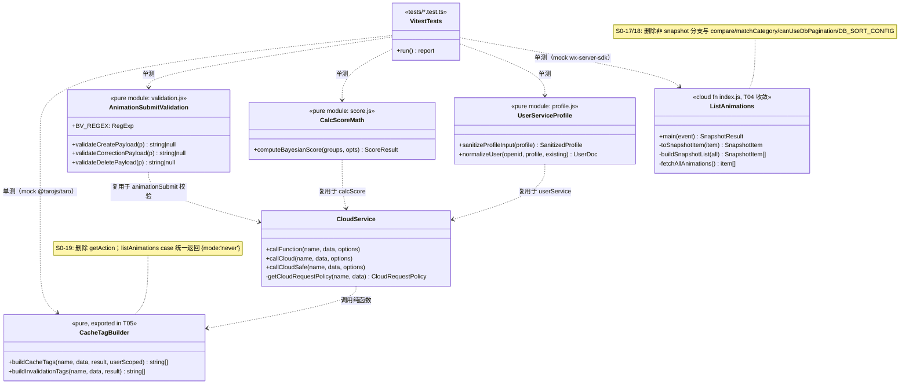
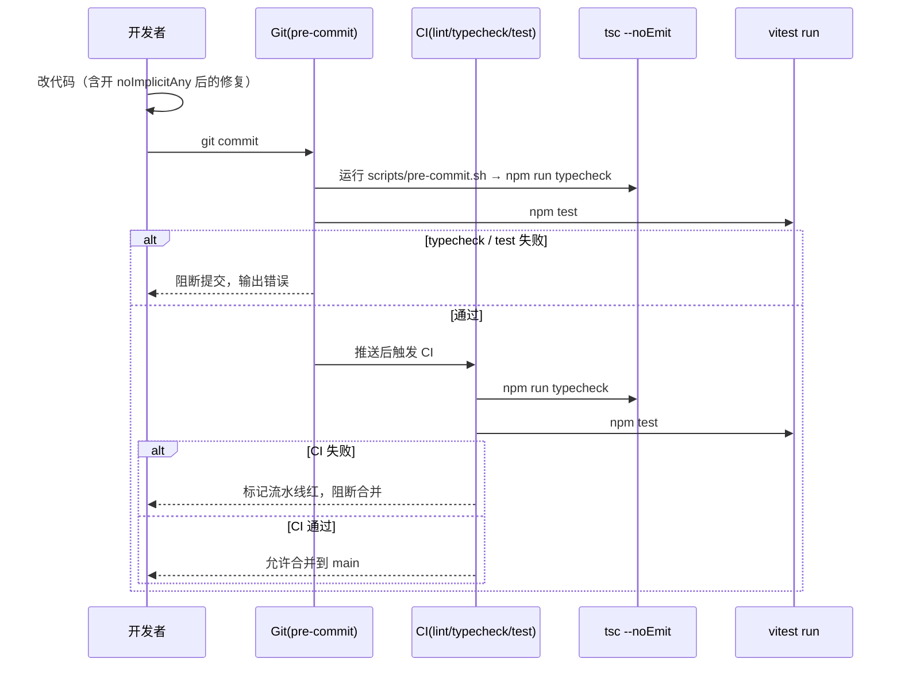
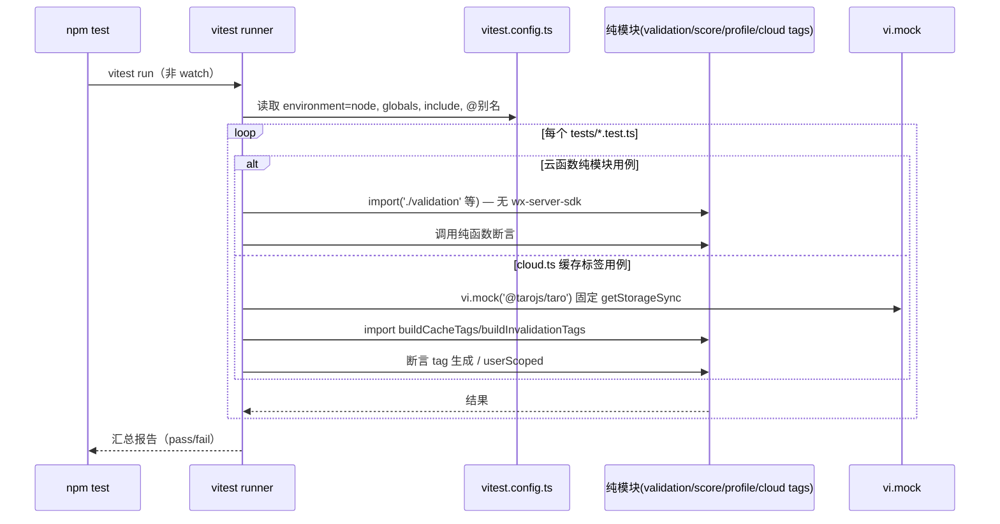
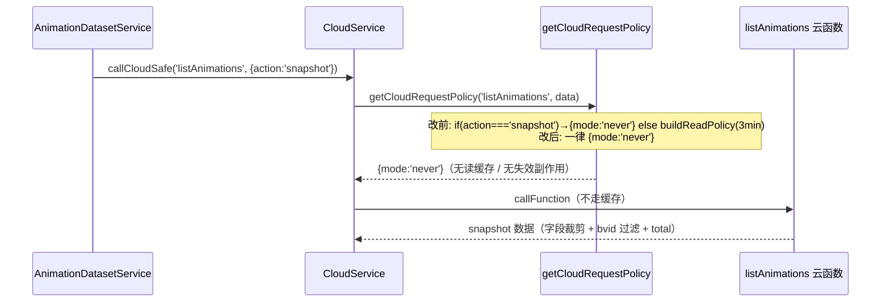

# 阶段 0（低风险高杠杆）技术债优化 — 系统设计与任务分解

- **角色**：架构师（高见远）
- **仓库**：`/Users/admin/workspace/miniprogram/sha-diao-taro`（Taro4 + React18 + TS + NutUI + 微信云开发）
- **关联 PRD**：`docs/stage0/prd.md`（S0-01 ~ S0-19，含 8 项待确认）
- **关联体检**：`docs/health-check/health-check-report.md` 的 H-02 / H-03 / H-04
- **原则**：仅做技术债优化，不新增业务功能；抽离/删除严禁改变既有对外行为（「重构不改行为」）。

---

## 一、实现方案 + 框架选型

### 1.1 三件事拆解与难点

| 阶段 0 项 | 难点 | 解决思路 |
|---|---|---|
| **H-02 类型门禁** | 当前 `tsconfig.check.json` 的 `noImplicitAny:false` + `strict:false`，开启后会暴露大量存量隐式 any | 先开门禁（仅 `noImplicitAny:true` 作为阶段 0 基线），再分批修存量错误；typecheck 仅覆盖 `miniprogram`（与现有 include 一致），不覆盖 `tests/` 与 `cloudfunctions/*.js` |
| **H-03 补核心单测** | 前端 TS/TSX + 云函数 `.js` 混存；云函数顶部 `require('wx-server-sdk')`，直接 import 会崩 | 选 **vitest** 作为运行器（见 1.3）；云函数校验/计算逻辑**抽离为无 `wx-server-sdk` 依赖的纯函数模块**，单测直接 import；`cloud.ts` 缓存标签测试用 `vi.mock('@tarojs/taro')` 固定 scope |
| **H-04 清死代码** | 删 `listAnimations` 非 snapshot 分支后，`cloud.ts` 的 `getAction` 失去唯一调用点；需先确认无其它调用方 | 先 grep 核对调用方（S0-16），再删除非 snapshot 分支及仅被其使用的辅助函数（S0-17/18），最后 `cloud.ts` 统一 `listAnimations → {mode:'never'}` 并移除 `getAction`（S0-19） |

### 1.2 架构模式

保持现状分层（页面/组件 → `services` → `CloudService.callFunction` → 云函数），**不引入任何新框架/状态库/UI 库**。本次新增的仅是「质量护栏」：`tsconfig.check.json` 门禁 + vitest 测试套件 + CI/提交钩子。云函数纯函数抽离采用「同目录轻量模块（`.js`）」模式，行为零改变。

### 1.3 测试运行器选型：**vitest（已拍板）**

**结论：选用 vitest，放弃 jest。**

理由（对照本项目实际）：

1. **TS/ESM 友好、配置轻量**：vitest 基于 Vite/esbuild，对 `.ts`、ESM、路径别名开箱即用，无需 ts-jest/babel 转译链；jest 需 `ts-jest` 或 babel-jest 额外配置，且 ESM 支持 historically 繁琐。
2. **与 `@` 别名一致**：`tsconfig.json` / `tsconfig.check.json` 的 `paths: { "@/*": ["miniprogram/*"] }` 可在 `vitest.config.ts` 用一条 `resolve.alias` 映射，测试既能 `import ... from '@/utils/fuzzy'` 也能用相对路径（兼容现有 `tests/request-cache.test.ts` 的相对导入）。
3. **`vi.mock` 解决云函数/ Taro 运行时依赖**：`cloud.ts` 依赖 `@tarojs/taro`、`wx-server-sdk` 在 node 环境缺失。vitest 的 `vi.mock('@tarojs/taro')` 可在测试内 stub `getStorageSync`，锁定用户 scope；云函数纯模块则不引入 `wx-server-sdk`，直接 import 即测。
4. **无需 jsdom**：阶段 0 仅覆盖纯函数与缓存标签生成（node 环境即可），`environment: 'node'` 足够；后续若要测组件再加 `jsdom`/`happy-dom`。
5. **启动快、生态现代**：vitest 与 Vite 同生态，watch/coverage 体验好；Node 22 已验证兼容（`vitest@^2.1`）。

> 若团队后续统一 jest，迁移成本可控（用例用 `assert`/原生断言，不绑死 vitest API）。

---

## 二、文件列表及相对路径（标注 新增 / 修改）

### 2.1 新增文件

| 路径 | 说明 | 关联任务 |
|---|---|---|
| `vitest.config.ts` | vitest 配置（node 环境、globals、include `tests/**/*.test.ts`、`@` 别名） | T01 |
| `.github/workflows/ci.yml` | CI 工作流：typecheck + test（平台待确认，见待明确事项） | T01 |
| `scripts/pre-commit.sh` | 可选本地 Git 钩子脚本（typecheck + test），不强行安装 | T01 |
| `tests/fuzzy.test.ts` | `fuzzy.ts` 单测（tokenize / fuzzyScore 五档 + 边界） | T02 |
| `tests/util.test.ts` | `util.ts` 单测（formatNumber/formatDuration/formatTime/formatDateTime/parseTags） | T02 |
| `tests/submission.test.ts` | `submission.ts` 单测（getSubmissionDisplay 三态） | T02 |
| `cloudfunctions/animationSubmit/validation.js` | 抽离纯函数：BV_REGEX + 3 个校验器 | T03 |
| `tests/animationSubmit.validation.test.ts` | animationSubmit 校验单测 | T03 |
| `cloudfunctions/calcScore/score.js` | 抽离纯函数：computeBayesianScore | T03 |
| `tests/calcScore.score.test.ts` | calcScore 贝叶斯计算单测 | T03 |
| `cloudfunctions/userService/profile.js` | 抽离纯函数：sanitizeProfileInput / normalizeUser | T03 |
| `tests/userService.profile.test.ts` | userService 归一化单测 | T03 |
| `tests/listAnimations.snapshot.test.ts` | listAnimations 快照回归单测（vi.mock wx-server-sdk） | T04 |
| `docs/stage0/callsite-check.md` | 调用方核对记录（S0-16 证据） | T04 |
| `tests/cloud-cache-tags.test.ts` | cloud.ts 的 buildCacheTags/buildInvalidationTags 单测 | T05 |

### 2.2 修改文件

| 路径 | 改动 | 关联任务 |
|---|---|---|
| `tsconfig.check.json` | `noImplicitAny: true`（移除 false） | T01 |
| `package.json` | 新增 `typecheck`、`test` 脚本；devDependency 加 `vitest` | T01 |
| `cloudfunctions/animationSubmit/index.js` | `require('./validation')`，委托校验逻辑（行为不变） | T03 |
| `cloudfunctions/calcScore/index.js` | `require('./score')`，委托贝叶斯计算（行为不变） | T03 |
| `cloudfunctions/userService/index.js` | `require('./profile')`，委托 sanitize/normalize（行为不变） | T03 |
| `cloudfunctions/listAnimations/index.js` | 删非 snapshot 分支 + 删 `compare`/`matchCategory`/`canUseDbPagination`/`DB_SORT_CONFIG`；导出 snapshot 纯逻辑供测试 | T04 |
| `miniprogram/services/cloud.ts` | 移除 `getAction`；listAnimations case 统一 `{mode:'never'}`；导出 `buildCacheTags`/`buildInvalidationTags` 供测试 | T05 |
| `miniprogram/**/*.ts(x)` 中触发 noImplicitAny 的文件 | 分批修复隐式 any（具体清单由 `npm run typecheck` 输出确定，典型含 `services/`、`utils/` 部分文件及页面/组件） | T05 |

---

## 三、数据结构和接口（关键函数签名 + mermaid 类图）

### 3.1 关键函数签名（抽离/新增的纯函数）

```ts
// ===== 前端 utils =====
// miniprogram/utils/fuzzy.ts（现有，被测）
export function tokenize(s: string): string[];
export function fuzzyScore(text: string, keyword: string): number; // 1000/500/200/100/30/0

// miniprogram/utils/util.ts（现有，被测）
export function formatNumber(n: number | string | undefined | null): string;
export function formatTime(date: string | Date | undefined | null): string;
export function formatDuration(input: number | string | undefined | null): string;
export function formatDateTime(input: string | Date | number | undefined | null): string;
export function parseTags(tag: string | string[] | undefined | null): string[];

// miniprogram/utils/submission.ts（现有，被测）
export function getSubmissionDisplay(it: Submission): SubmissionDisplay;

// ===== cloud.ts 缓存标签（现有私有，T05 导出供测）=====
// miniprogram/services/cloud.ts
export function buildCacheTags(name: string, data: CloudFunctionData, result: CloudFunctionResultData, userScoped: boolean): string[];
export function buildInvalidationTags(name: string, data: CloudFunctionData, result: CloudFunctionResultData): string[];
// T05 删除：function getAction(data?) — 见 S0-19

// ===== 云函数抽离纯模块（新增 .js，零 wx-server-sdk 依赖）=====
// cloudfunctions/animationSubmit/validation.js
const BV_REGEX = /^BV1[A-Za-z0-9]{8,}$/;
function validateCreatePayload(p: any): string | null;     // 缺字段/空值/duration 非正/bvid 格式错
function validateCorrectionPayload(p: any): string | null; // title + tag 非空
function validateDeletePayload(p: any): string | null;     // reason 至少 4 字
module.exports = { BV_REGEX, validateCreatePayload, validateCorrectionPayload, validateDeletePayload };

// cloudfunctions/calcScore/score.js
function computeBayesianScore(
  groups: Array<{ _id: number; count: number }>,
  opts: { m: number; C: number }
): { WR: number; R: number; v: number; C: number; distribution: Record<string, number> };
module.exports = { computeBayesianScore };

// cloudfunctions/userService/profile.js
function sanitizeProfileInput(profile?: any): { nickName?: any; avatarUrl?: any; phoneNumber?: any };
function normalizeUser(openid: string, profile?: any, existing?: any): UserDoc; // is_admin 仅取 existing，绝不读 profile
module.exports = { sanitizeProfileInput, normalizeUser };

// ===== listAnimations 快照纯逻辑（T04 导出供测）=====
// cloudfunctions/listAnimations/index.js（删除非 snapshot 分支后）
function toSnapshotItem(item: any): SnapshotItem | null; // 字段裁剪 + bvid 过滤
function buildSnapshotList(all: any[]): SnapshotItem[];  // map(toSnapshotItem).filter(bvid)
```

### 3.2 mermaid 类图



---

## 四、程序调用流程（mermaid 时序图）

### 4.1 质量门禁流程：改 tsconfig → typecheck → 提交/CI 阻断



### 4.2 单测执行链路（vitest，纯函数零运行时依赖）



### 4.3 listAnimations 缓存策略前后对比（S0-19 影响面）



---

## 五、任务列表（有序、含依赖、按实现顺序）

> 规则遵循：共 **5 个任务**（硬上限）；每个任务 ≥3 个文件；首个任务为基础设施；T02~T05 均仅依赖 T01（互不冲突，可并行安排）。

### T01 — 项目基础设施与质量门禁（H-02 / H-03 基座）

- **对应 S0**：S0-01, S0-02, S0-03, S0-06（并承载 S0-07 现有用例纳管）
- **文件**：`tsconfig.check.json`(改)、`package.json`(改)、`vitest.config.ts`(新)、`.github/workflows/ci.yml`(新)、`scripts/pre-commit.sh`(新)
- **动作**：
  1. `tsconfig.check.json`：`"noImplicitAny": true`（移除 false），其余保持。
  2. `package.json`：新增 `"typecheck": "tsc --noEmit -p tsconfig.check.json"`、`"test": "vitest run"`；devDependencies 加 `"vitest": "^2.1.0"`。
  3. 新增 `vitest.config.ts`：`test.environment='node'`、`globals=true`、`include=['tests/**/*.test.ts']`、`resolve.alias['@']=path.resolve(__dirname,'miniprogram')`。
  4. 新增 `.github/workflows/ci.yml`：步骤 `npm ci && npm run typecheck && npm test`（平台见待明确事项）。
  5. 新增 `scripts/pre-commit.sh`：依次 `npm run typecheck` 与 `npm test`；文档说明挂载方式（`cp scripts/pre-commit.sh .git/hooks/pre-commit` 或 `git config core.hooksPath`），**不强行安装 husky**。
- **验收**：`npm run typecheck` 可运行；`npm test` 跑通现有 `tests/request-cache.test.ts`（0 失败）；CI 含 typecheck+test 步骤（若暂不接 CI，则以 `scripts/pre-commit.sh` + 团队约定替代，并在文档标注）。
- **依赖**：无
- **优先级**：P0

### T02 — 前端工具函数单测（H-03 前端）

- **对应 S0**：S0-08, S0-09, S0-10
- **文件**：`tests/fuzzy.test.ts`(新)、`tests/util.test.ts`(新)、`tests/submission.test.ts`(新)（被测源文件 `fuzzy.ts`/`util.ts`/`submission.ts` 仅读取，不改）
- **动作**：
  1. `fuzzy.test.ts`：覆盖 `tokenize` 分词、`fuzzyScore` 五档（exact 1000 / startsWith 500 / includes 200 / 有序 100 / 全包含 30 / 0）、大小写、空输入、纯符号。
  2. `util.test.ts`：覆盖 `formatNumber`（k/w/亿 边界 + 负数/NaN→'0'）、`formatDuration`（数字/字符串/非法→'--:--'）、`formatTime`、`formatDateTime`、`parseTags`（中英文逗号/分号/空白）。
  3. `submission.test.ts`：覆盖 `getSubmissionDisplay` 在 create / correction / correction_delete 三态正确提取 title/cover/upName/bvid/duration/url，含 payload/target 为空兜底。
- **验收**：各评分分支与正负边界、非法输入均有用例且通过；不改既有断言语义。
- **依赖**：T01
- **优先级**：S0-08/09 P0，S0-10 P1

### T03 — 云函数纯函数抽离与校验/计算单测（H-03 云函数）

- **对应 S0**：S0-11, S0-12, S0-13
- **文件**：`cloudfunctions/animationSubmit/validation.js`(新)、`cloudfunctions/animationSubmit/index.js`(改)、`cloudfunctions/calcScore/score.js`(新)、`cloudfunctions/calcScore/index.js`(改)、`cloudfunctions/userService/profile.js`(新)、`cloudfunctions/userService/index.js`(改)、`tests/animationSubmit.validation.test.ts`(新)、`tests/calcScore.score.test.ts`(新)、`tests/userService.profile.test.ts`(新)
- **动作**：
  1. 抽离 `validateCreatePayload` / `validateCorrectionPayload` / `validateDeletePayload` / `BV_REGEX` 到 `validation.js`；`index.js` 改 `require('./validation')`，校验逻辑原样委外（行为不变）。
  2. 抽离贝叶斯计算到 `score.js`（`computeBayesianScore(groups, {m, C})`）；`index.js` 传入实际 `C`（DB 或 `DEFAULT_C`）后委托（行为不变）。
  3. 抽离 `sanitizeProfileInput` / `normalizeUser` 到 `profile.js`；`index.js` 改 `require('./profile')`（行为不变，`is_admin` 仍仅取 existing）。
  4. 三个 `tests/*.test.ts` 直接 `import` 纯模块断言（无需 `wx-server-sdk`）。
- **验收**：各校验分支有正反例；BV 正则覆盖合法/非法；WR 在 `v` 极小/极大时向 `C` 收敛、`distribution` 聚合正确；恶意 profile 不会写入 `is_admin`；缺失字段取 existing/默认。
- **依赖**：T01
- **优先级**：P0

### T04 — 清理 listAnimations 死代码与快照回归（H-04 云函数）

- **对应 S0**：S0-16, S0-17, S0-18
- **文件**：`cloudfunctions/listAnimations/index.js`(改)、`tests/listAnimations.snapshot.test.ts`(新)、`docs/stage0/callsite-check.md`(新)
- **动作**：
  1. **S0-16**：运行全局 grep，确认 `listAnimations` 仅 `animationDataset.ts:190`（`action:'snapshot'`）与 `cloud.ts` 内部引用，写入 `callsite-check.md`。
  2. **S0-17**：删除 `exports.main` 中非 snapshot 分支（快速 DB 分页 + 慢速全量路径），仅保留 `action==='snapshot'`；导出 `toSnapshotItem` / `buildSnapshotList` 供测试。保留 `fetchAllAnimations` / `parseDurationToSec` / `toSnapshotItem`。
  3. **S0-18**：删除仅被非 snapshot 分支使用的 `compare` / `matchCategory` / `canUseDbPagination` / `DB_SORT_CONFIG`（grep 已确认无其它引用）。
  4. 写 `listAnimations.snapshot.test.ts`：用 `vi.mock('wx-server-sdk')` stub 后 `require` 模块，断言快照输出（字段裁剪、bvid 过滤、`total=all.length`、`pageSize=all.length`）与删除前一致。
- **验收**：`exports.main` 仅处理 `action==='snapshot'`；grep 已删符号无残留；快照输出零回归；`callsite-check.md` 记录调用方。
- **依赖**：T01
- **优先级**：P0

### T05 — cloud.ts 缓存策略收敛 + 缓存标签单测 + 存量类型错误分批修复（H-04 + H-02）

- **对应 S0**：S0-19, S0-14, S0-04, S0-05
- **文件**：`miniprogram/services/cloud.ts`(改)、`tests/cloud-cache-tags.test.ts`(新)、以及一批 `miniprogram/**/*.ts(x)` 源文件（按 `npm run typecheck` 报错清单修复，≥2 个，典型含 `services/`、`utils/` 部分文件）
- **动作**：
  1. **S0-19**：删除 `cloud.ts` 的 `getAction`；`getCloudRequestPolicy` 的 listAnimations case 移除 `if(action==='snapshot')` 分支，统一 `return { mode: 'never' }`。
  2. **S0-14**：导出 `buildCacheTags` / `buildInvalidationTags`（最小改动，行为不变）；写 `cloud-cache-tags.test.ts`，用 `vi.mock('@tarojs/taro')` 固定 `getStorageSync` 锁定 scope，断言各云函数 case 的 tag 生成与 `userScoped` 行为。
  3. **S0-04**：运行 `npm run typecheck` 得到存量隐式 any 基线清单，分批修复直至 `miniprogram` 下 `npm run typecheck` 在 main 可重复通过（零新增错误 / 不高于基线）；随附修复清单。
  4. **S0-05**：确认云函数 `.js` 维持 ESLint 校验（不强制 tsc）。
- **验收**：`getAction` 无未使用报错；`listAnimations` 一律 `mode:'never'` 无读缓存/失效副作用；缓存标签单测通过；typecheck 可重复通过并附清单。
- **依赖**：T01
- **优先级**：P0

---

## 六、依赖包列表（含版本建议）

| 包 | 版本 | 类型 | 用途 |
|---|---|---|---|
| `vitest` | `^2.1.0` | devDependency（**新增**） | 单测运行器（node 环境、globals、`vi.mock`、ESM/`@` 别名） |
| `@vitest/coverage-v8` | `^2.1.0` | devDependency（**可选**） | 覆盖率统计；阶段 0 不设门槛，按需启用 |
| `typescript` | 沿用现有 | devDependency（已有） | `tsc --noEmit` 门禁（版本随 Taro4 现有） |
| `eslint` / `eslint-config-taro` | 沿用现有 | devDependency（已有） | 云函数 `.js` 校验（H-02 S0-05） |
| `husky` + `lint-staged` | — | **待用户拍板**（不强行安装） | 提交前自动 typecheck/test（见待明确事项 Q2/Q3） |

> 不新增任何运行时依赖（runtime deps 不变）。vitest 自带 `vite`/esbuild 传递依赖，无需单独装。

---

## 七、共享知识（跨文件约定）

1. **缓存 tag 命名**：沿用 `cloud.ts` 现有约定——前缀 `fn:`（云函数名）、`animation:<bvid>`、`user:<openid>`（scope）、`review:item:<_id>` 等；scope 通过 `@<token>` 后缀隔离；去重/过滤统一走 `finalizeTags`。新增缓存逻辑须复用这些前缀，**禁止自定义格式**。
2. **测试目录约定**：仓库根 `tests/`，文件命名 `*.test.ts`；vitest `include` 该目录（不动现有 `tests/request-cache.test.ts` 的相对导入）。云函数纯模块与 `index.js` **同目录**（如 `validation.js`）。
3. **纯函数导出约定**：可单测的校验/计算逻辑抽为**无副作用、不 `require('wx-server-sdk')`** 的模块；原 `index.js` 以 `require('./x')` 引用，**行为零改变**。测试直接 import 纯模块，避免加载云运行时。
4. **`@` 别名**：`vitest.config.ts` 配 `resolve.alias['@'] = miniprogram`，与 `tsconfig` 的 `paths` 一致；测试可 `import ... from '@/utils/fuzzy'` 或用相对路径。
5. **Taro 运行时 mock**：测 `cloud.ts` 缓存标签时 `vi.mock('@tarojs/taro')` 固定 `getStorageSync` 以锁定 scope（`guest` 或 `user:xxx`）；测 `listAnimations` 时 `vi.mock('wx-server-sdk')` stub 以加载模块。
6. **行为保持红线**：所有抽离/删除均不改变既有对外行为；删死代码前必须 grep 确认无调用方，证据写入 `docs/stage0/callsite-check.md`。
7. **类型门禁范围**：`typecheck` 仅覆盖 `miniprogram`（与 `tsconfig.check.json` 的 `include` 一致），**不覆盖** `tests/` 与 `cloudfunctions/*.js`；云函数靠 ESLint 校验。
8. **提交/CI 门禁**：`typecheck` 与 `test` 仅通过 CI 与本地 `pre-commit` 钩子触发，**不接入 `build:weapp`**（避免阻塞 dev watch）。

---

## 八、待明确事项（8 项待确认收敛）

> PRD 提出 Q1~Q8。架构师已对 6 项拍板，2 项需用户最终拍板。

### 架构师已拍板（6 项）

| 编号 | 问题 | 拍板结论 |
|---|---|---|
| **Q1** | 是否同期开 full `strict`？ | **仅开 `noImplicitAny:true` 作为阶段 0 基线**；`strictNullChecks` 已开，其余 strict 项（strictFunctionTypes/strictBindCallApply/useUnknownInCatchVariables）留待后续阶段，避免一次性大规模 break。 |
| **Q4** | 测试运行器 vitest 还是 jest？ | **vitest**（理由见 1.3）。 |
| **Q5** | typecheck/test 是否接入 `build:weapp` 前置？ | **不接入** `build:weapp`；仅由 CI 与本地 `pre-commit` 钩子触发，不阻塞本地 dev watch。 |
| **Q6** | 覆盖率门槛？ | 阶段 0 **不设最低覆盖率**；验收 = 套件可重复绿 + 优先覆盖清单（S0-08~S0-14）通过。`@vitest/coverage-v8` 可选启用但不设阈值。 |
| **Q7** | 删非 snapshot 分支后是否移除 `compare`/`matchCategory`？ | **移除**（grep 确认仅被死分支使用；前端已长期分叉到本地快照）。 |
| **Q8** | `getAction` 是否移除？ | **移除 `cloud.ts` 的 `getAction`**（S0-19 后失去唯一调用点）。注意：另一个 `getAction` 在 `cloudfunctions/animationReview/index.js:88`（不同模块、仍有调用），**不触碰**。 |

### 仍需用户拍板（2 项）

| 编号 | 问题 | 设计默认建议 | 需用户确认点 |
|---|---|---|---|
| **Q2 / Q3** | CI 平台与是否启用 husky 自动 pre-commit | 设计已提供 `.github/workflows/ci.yml`（GitHub Actions 默认）+ `scripts/pre-commit.sh`（可选本地钩子，不强行安装）。 | ① 仓库托管环境是否支持 GitHub Actions？或改用微信云 CI？② 是否授权安装 `husky`+`lint-staged` 做提交前自动 typecheck/test？（当前仅提供脚本，未加 devDep、未改 `package.json` 的 `prepare` 钩子，避免安装未授权包。） |
| （补充） | CI 是否一并跑 `build:weapp` | 建议 CI 仅跑 `typecheck` + `test`（构建另行/人工），避免流水线过长。 | 是否需要在 CI 内也验证 `build:weapp` 通过？ |

> 其余 PRD 待确认（如 H-01 快照版本自动化、H-06 score 语义等）属「阶段 1+」范畴，不在阶段 0 范围，按路线图后续处理。
