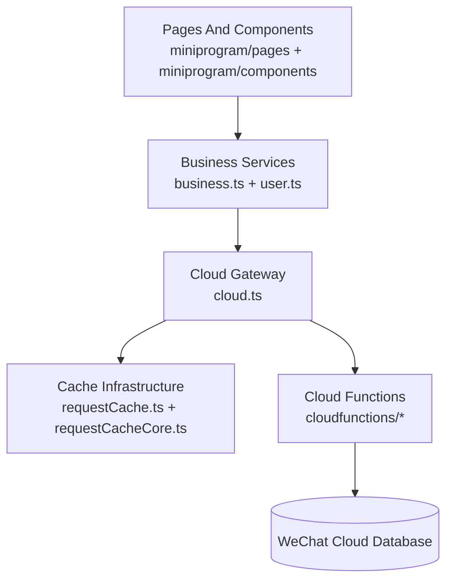
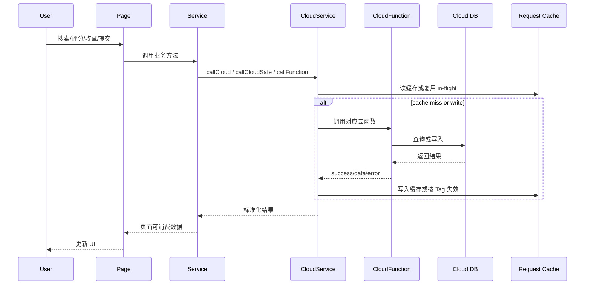

# Project Analysis

## Project Thesis

这个仓库本质上不是一个“页面直接调云开发”的轻量小程序，而是一个围绕 `bvid` 统一主键、以云函数为唯一业务入口、并在客户端服务层做缓存与失效编排的微信小程序业务系统。它的真正价值不在页面数量，而在把评分、收藏、录入、审核、搜索和用户态这些分散能力收束成一套稳定的数据流约束。

- 最强证据来自 `miniprogram/app.tsx`、`miniprogram/services/cloud.ts`、`miniprogram/services/business.ts` 和 `cloudfunctions/*`：启动即初始化云开发、缓存清理和用户态，而页面层被明确限制为只通过 service 调用云函数。
- 定义整个代码库的核心约束是“前端不直连数据库、业务主键只认 `bvid`、写操作必须走缓存 Tag 精准失效”，这让它更接近一个前后端边界清晰的 serverless 应用，而不是模板式小程序。
- 它刻意不走“客户端直接查库 + 页面自己拼业务”的路线，这降低了页面复杂度，也把正确性压力集中到了 service 和云函数层。

**Project Metadata**

| Field | Value |
|-------|-------|
| Project Name | `shrimp-universe` |
| Repository | `/Users/admin/workspace/miniprogram/sha-diao-taro` |
| Primary Language | TypeScript |
| License | Apache-2.0，可商用、可闭源集成，但分发修改版时需保留许可证与版权/NOTICE 信息，并带专利终止条款 |
| Analysis Date | 2026-06-27 |

---

## Repository Shape

这是一个单应用仓库，不是 monorepo；真正的结构边界按“前端壳层 / 服务层 / 云函数后端 / 缓存与类型基础设施 / 单点测试”划分，而不是按 package 划分。

**Application Surface**

| Package | Path | Role |
|---------|------|------|
| WeChat Mini Program | `miniprogram/` | Taro React 前端页面、组件、服务、类型和工具函数 |
| Cloud Functions | `cloudfunctions/` | 所有业务读写的唯一后端入口，负责数据库访问和审核落地 |

**Shared Runtime Infrastructure**

| Package | Path | Role |
|---------|------|------|
| Request Cache | `miniprogram/services/requestCache.ts` `miniprogram/utils/requestCacheCore.ts` | 本地缓存适配、稳定序列化、TTL、LRU、Tag 精准失效 |
| Business Services | `miniprogram/services/business.ts` `miniprogram/services/user.ts` | 页面与云函数之间的业务 API 面 |
| App Bootstrap | `miniprogram/app.tsx` `miniprogram/app.config.ts` | 小程序启动链路、生命周期清理、页面注册、原生 tabBar |

**Tooling And Verification**

| Package | Path | Role |
|---------|------|------|
| Build Config | `package.json` `config/` | Taro 多端构建和开发脚本 |
| Focused Test | `tests/request-cache.test.ts` | 仅覆盖缓存核心行为，没有扩展到主业务流 |
| Docs | `README.md` `AGENTS.md` | 当前架构约束和开发约定写得比较清晰，且最近有同步维护痕迹 |

依赖关系是单向的：`pages/components -> services -> cloud.ts -> cloudfunctions -> cloud database`；这个顺序在文档和代码里是一致的。

---

## Tech Stack

这个项目采取了“前端 TypeScript 化、后端云函数 JavaScript 化、运行基础设施自己补齐”的技术姿态，重点不在框架新旧，而在把小程序常见的边界失控问题用自定义 service 层和缓存层收回来。

| Category | Technology | Version | Architectural Role |
|----------|-----------|---------|-------------------|
| Language | TypeScript | `^5.1.0` | 支撑前端页面、服务、类型和缓存核心的静态约束，降低页面层状态拼接的脆弱性 |
| UI Framework | React + Taro | `React 18` + `Taro 4.1.9` | 用 React 组件模型统一小程序页面与组件开发，同时保留多端构建能力 |
| UI Library | NutUI React Taro | `^3.0.19` | 提供交互组件和样式基线，但业务布局仍由本项目自定义组件主导 |
| Cloud Backend | WeChat Cloud Functions + Cloud Database | managed | 业务数据读写全部在云函数完成，客户端不持有 DB 入口 |
| State / Runtime | Zustand | `^4.5.0` | 依赖已安装，但当前架构主要还是 service + local state，并未把全局状态设计押在 Zustand 上 |
| Cache | Custom Request Cache | in-repo | 这是最有架构分量的自研基础设施，负责 TTL、LRU、用户作用域和 Tag 失效 |
| Testing | `ts-node` + `assert` | in-repo | 只有缓存核心有聚焦测试，说明质量保障目前偏基础设施而非业务回归 |
| Build | Taro CLI + Webpack 5 | `4.1.9` / `5.78.0` | 小程序与 H5 构建入口统一在 `package.json` 中维护 |
| CI/CD | None detected | — | 仓库中没有 GitHub Actions、Jenkinsfile 或其他 pipeline 配置，质量门禁主要依赖本地执行 |
| Infrastructure | WeChat mini-program + cloud env | managed | 部署依赖微信开发者工具和指定云环境，运行与交付都绑定微信生态 |

**Dependency Observations**

- 真正的负载型依赖不是 UI 库，而是 `@tarojs/*` 全家桶和微信云开发运行模型；它决定了构建方式、运行约束和调试路径都要围绕微信生态展开。
- 项目把缓存系统写在仓库内部而不是引入第三方请求缓存库，说明作者更看重可控的失效语义，而不是通用缓存 API。
- `package.json` 里有 20 个 runtime 依赖、29 个 dev 依赖，但缺少独立测试框架与 CI 集成，表明工程更重交付能力而不是自动化质量链路。

---

## Architecture Design

这个项目是一个前端与后端都在同仓库内的 serverless 风格模块化单体，真正的边界不是进程边界，而是“页面不得越过 service 层”这一编码约束。

### Architecture Pattern

它采用的是“单仓库前端 + 云函数后端 + 云数据库”的模块化单体模式。优点是小程序页面可以保持轻量，云函数可以独立承载鉴权、查询、审核和数据落地；代价是前后端协议、缓存 Tag 和业务主键必须手工保持一致，一旦某层改动不同步，就会直接表现为数据错乱或缓存脏读。

### Execution Flow

最可信的运行路径已经在文档和脚本里对齐：本地开发靠 `Taro` 编译，后端靠微信开发者工具部署云函数，缓存核心有一组独立脚本级回归测试。

```text
Build:  yarn build:weapp
Run:    yarn dev:weapp
Test:   npx ts-node tests/request-cache.test.ts
Deploy: 微信开发者工具手动上传并部署相关云函数
```

这套流程可以工作，但它没有自动化 pipeline；“能不能构建、有没有部署遗漏、云函数是否同步更新”目前都依赖开发者自觉。

### Layer Structure

磁盘结构和运行结构基本一致，说明这不是“目录分层漂亮但运行时互相穿透”的假分层。



- 页面层主要负责展示、交互和局部状态，例如 `miniprogram/pages/search/index.tsx` 中的搜索历史、分页状态和筛选状态。
- 业务层把动作整理成 `AnimationService`、`RatingService`、`CollectionService`、`SubmissionService`、`ReviewService` 和 `UserService`，把页面从云函数 payload 细节中隔离出来。
- `CloudService` 是横切基础设施，不只是 transport wrapper；它同时承担超时控制、日志、in-flight 复用、缓存写入和失效。
- 云函数层是唯一允许接触数据库的地方；这一点通过代码搜索也得到了验证，`miniprogram/` 内仅 `services/cloud.ts` 出现了 `Taro.cloud.callFunction`。

### Data Flow

这个项目最有业务价值的主路径是“用户触发页面动作，service 调云函数，云函数读写数据库，客户端缓存按语义精确失效”，而不是单纯的列表渲染。



具体证据：

- 启动链路在 `miniprogram/app.tsx` 中依次调用 `CloudService.init()`、`RequestCacheService` 清理和 `UserService.bootstrap()`。
- 典型页面 `miniprogram/pages/search/index.tsx` 的 `doSearch()` 通过 `AnimationService.search()` 拉取 `{ list, total }`，结果头明确展示服务端 `total`。
- `AnimationService.search()` 在 `miniprogram/services/business.ts` 中直接调用云函数 `search`，而 `cloudfunctions/search/index.js` 再执行数据库候选查询和 `fuzzyScore` 排序。

---

## Core Modules

这个仓库的重心并不在页面本身，而是在保证页面永远只碰稳定业务接口的那几层基础模块上。

### `CloudService` `miniprogram/services/cloud.ts`

- **Role**: 统一云函数调用入口，负责超时、日志、缓存命中、in-flight 复用、Tag 生成和写后失效。
- **Key inputs/outputs**: 输入是云函数名、payload、超时参数；输出是标准化的云函数结果或安全降级结果。
- **Why it matters**: 这是前后端边界和缓存边界的同一个控制点。若这一层退化成简单 wrapper，页面很快会重新散落出各自的请求、错误处理和缓存逻辑。

### `AnimationService` / `SubmissionService` / `ReviewService` `miniprogram/services/business.ts`

- **Role**: 定义动画列表、详情、搜索、评分、收藏、录入、勘误、审核等业务 API 面。
- **Key inputs/outputs**: 输入是页面语义化参数，例如 `bvid`、`keyword`、`typeFilter`；输出是页面可直接消费的列表、详情和操作结果。
- **Why it matters**: 这里决定了页面是否依赖底层协议细节。现在的设计把页面从云函数 `action`、`success/error` 结构里解耦出来，是维持前端整洁度的关键。

### `UserService` `miniprogram/services/user.ts`

- **Role**: 封装静默登录、手机号登录、建档、头像上传、资料更新、统计读取和管理员状态读取。
- **Key inputs/outputs**: 输入是登录授权结果或资料 patch；输出是全局用户态、档案数据和统计数据。
- **Why it matters**: 小程序用户态往往容易分裂为“微信会话存在但云端用户态未同步”；这个模块用 `silentLogin -> fetchUserInfo -> upsert fallback` 把断层补上了。

### Request Cache Core `miniprogram/utils/requestCacheCore.ts`

- **Role**: 实现稳定序列化、哈希键、TTL 过期回收、LRU 淘汰和按 Tag 失效。
- **Key inputs/outputs**: 输入是缓存键、值、TTL、tags；输出是缓存命中结果和清理结果。
- **Why it matters**: 这层把“请求缓存是否可信”从经验性优化变成了具备明确语义的数据结构。项目的性能和状态一致性都依赖它，而不是依赖页面手写 `setStorageSync`。

### Search Pipeline `cloudfunctions/search/index.js` + `miniprogram/utils/fuzzy.ts`

- **Role**: 实现“宽松候选集拉取 + 模糊评分排序 + 分类过滤 + 分页返回”的搜索主路径。
- **Key inputs/outputs**: 输入是 `keyword`、分页和分类；输出是排序后的动画分页数据与 `total`。
- **Why it matters**: 搜索是此类内容应用的核心交互之一。这个项目明确把算法分成前后端两份实现并要求同步，说明它已经把搜索相关性视为产品能力，而不是单纯的 SQL/RegExp 条件过滤。

### Review Workflow `cloudfunctions/animationSubmit/index.js` + `cloudfunctions/animationReview/index.js`

- **Role**: 承接投稿、勘误、删除申请，审核通过后将变更落地到 `animations` 集合。
- **Key inputs/outputs**: 输入是 submission payload、审核动作和管理员评论；输出是 submission 状态与用于缓存失效的元信息。
- **Why it matters**: 这是业务闭环中最难保持一致的一段。当前实现不仅处理状态流转，还会在审核返回中附带 `submissionId`、`submitterOpenid`、`targetBvid` 和 `bvid`，直接服务于前端缓存精准失效。

### User Backend `cloudfunctions/userService/index.js`

- **Role**: 提供用户档案读取、upsert、资料更新、统计和管理员标记接口。
- **Key inputs/outputs**: 输入是 action 和 profile/target_openid；输出是用户档案、计数信息或管理操作结果。
- **Why it matters**: 这个模块是前端用户态的唯一后端真相来源，同时也暴露出当前代码库最严重的安全风险之一：管理员标记接口没有做管理员鉴权。

---

## Distinctive Design Decisions

这个代码库最有辨识度的地方，不是用了 Taro 或 NutUI，而是它对“小程序最容易失控的几条边界”做了强约束。

1. **统一以 `bvid` 作为业务主键** — `README.md`、`AGENTS.md`、`miniprogram/services/business.ts` 和多个云函数都围绕 `bvid`/`animation_bvid`/`target_bvid` 组织数据，而不是继续复用数据库 `_id`。这让跨集合关联、页面跳转和缓存 Tag 可以共享同一套标识语义；代价是所有旧路径都必须一起迁移，不能局部兼容一半。

2. **页面禁止直接触达数据库或云函数** — 从文档约束到代码搜索结果都表明，`miniprogram/` 内只有 `services/cloud.ts` 才调用 `Taro.cloud.callFunction`。这让 UI 重构不会顺手侵入业务层，但也把大量正确性责任集中到了 service 层，一旦 service API 设计不稳，会放大对所有页面的影响。

3. **缓存不是“可有可无的优化”，而是协议的一部分** — `miniprogram/services/cloud.ts` 中的 `buildCacheTags()` 和 `buildInvalidationTags()` 为不同函数定义了语义化缓存与失效规则。这样做的收益是读写一致性可以被系统化维护；代价是每新增一个读写接口，都必须同步思考 Tag 设计，否则就会出现局部陈旧数据。

4. **审核返回元信息以驱动缓存失效** — `cloudfunctions/animationReview/index.js` 在审批成功后返回 `submissionId`、`submitterOpenid`、`targetBvid`、`bvid` 等元信息，这并不是典型 CRUD 返回值，而是专门服务于前端缓存系统的协议设计。这个选择说明系统已经不满足于“操作成功”语义，而是要求写路径能立即反映到多个读视图。

5. **搜索算法明确要求前后端双实现同步** — 文档强制同时维护 `miniprogram/utils/fuzzy.ts` 和 `cloudfunctions/search/index.js`。这让前端可以复用一致的匹配语义，也避免服务端行为成为黑箱；但它增加了演进成本，任何算法修改都必须双份回归。

6. **登录链路优先保证前端状态不丢** — `miniprogram/services/user.ts` 在 `getInfo` 和 `upsert` 都失败时仍会构造本地兜底用户对象，避免出现“看起来登录成功但页面回到未登录态”的体验断裂。这个决策优先保证前端连续性，但也意味着运行时可能出现“本地已登录、云端未完全建档”的短暂偏差。

---

## Quality Signals & Risks

这个仓库的质量姿态是“基础设施层已经有明显工程意识，但自动化质量链路和安全封口仍不完整”。

### Testing

| Metric | Status | Observation |
|--------|--------|-------------|
| Test Framework | `ts-node` + Node `assert` | 没有完整测试框架基建，但脚本能跑通核心断言 |
| Unit Tests | Present | `tests/request-cache.test.ts` 覆盖重复请求命中、TTL、LRU、异常降级和 Tag 失效 |
| Integration Tests | Absent | 没有对云函数协议、搜索链路、审核流程或登录流程的集成验证 |
| E2E Tests | Absent | 没有小程序端到端回归 |
| Test Quality | Adequate | 缓存测试是有价值的，不是凑覆盖率；但范围集中在基础设施，业务路径基本无自动化保护 |

### CI/CD

仓库中没有检测到 GitHub Actions、Jenkinsfile 或其他 CI 配置，说明构建、测试和云函数同步部署都依赖本地手工执行。对这个项目而言，缺 CI 的实际后果不是“少一个徽章”，而是前后端协议变更、缓存失效规则遗漏、云函数漏部署都很难在合并前被自动拦住。

### Documentation

| Document | Status | Quality |
|----------|--------|---------|
| README | Present | Good |
| API Docs | Partial | Adequate |
| Architecture Docs | Present | Good |
| Inline Comments | Adequate | Adequate |
| Onboarding Guide | Present | Good |

`README.md` 和 `AGENTS.md` 当前与代码实现基本一致，尤其对 `bvid` 主键、缓存失效、原生 tabBar 和云函数边界的说明比较明确，这是一个明显的正向信号。

### Code Style & Hygiene

- `package.json` 中包含 `eslint`、`eslint-config-taro`、`@typescript-eslint/*` 和 `stylelint`，表明项目具备静态检查工具。
- 但仓库里没有看到这些检查被自动执行的 pipeline，因此“配了 lint”不等于“被持续强制执行”。
- 代码风格整体统一，service 层和云函数层命名约定较稳，说明项目在手工协作阶段已经有一定纪律。

### Risk Table

| # | Risk | Severity | Category | Evidence | Impact |
|---|------|----------|----------|----------|--------|
| 1 | `setAdmin` 接口缺少管理员鉴权 | High | Security | `cloudfunctions/userService/index.js` 中 `setAdmin()` 直接写目标用户 `is_admin`，没有校验调用者是否为管理员 | 任意已登录用户理论上都可能给自己或他人提权，直接破坏审核和管理边界 |
| 2 | 搜索云函数候选集被硬编码限制为 200 条 | Medium | Scalability | `cloudfunctions/search/index.js` 中查询候选集时固定 `.limit(200)` | 数据量增长后，相关性排序只在截断后的子集上进行，搜索结果完整性会下降 |
| 3 | 自动化质量门禁缺失 | Medium | Operations | 仓库未检测到 CI 配置，测试仅有 `tests/request-cache.test.ts` | 前后端协议漂移、云函数漏部署、构建失败和安全回归更容易在人工流程中漏掉 |
| 4 | 云环境硬编码在客户端基础设施中 | Medium | Operations | `miniprogram/services/cloud.ts` 直接写死 `CLOUD_ENV` | 环境切换、多人协作和多环境发布容易出错，且不利于 staging / production 分离 |
| 5 | 缓存体系强依赖人工维护 Tag 语义 | Medium | Maintainability | `miniprogram/services/cloud.ts` 为不同函数手工维护 `buildCacheTags()` 与 `buildInvalidationTags()` | 新增或修改接口时，只要漏掉一个 Tag，就可能出现难复现的局部脏数据 |

### Commercial & Reuse Viability

Apache-2.0 对商业采用总体友好，这个仓库可以被商业项目使用、修改和闭源嵌入，但分发时必须履行保留许可证和归属信息的义务，并接受专利终止条款。

- **Commercial use**: 可以，Apache-2.0 允许商业使用。
- **Closed-source embedding**: 可以，允许嵌入闭源产品，不要求整体开源。
- **Modification & redistribution**: 可以修改并再分发，但必须保留许可证、版权声明和相关 NOTICE/归属信息。
- **Secondary development**: 适合做二次开发底座，尤其是微信生态内的内容型小程序；但上线前必须先补安全与自动化质量链路。
- **Patent clauses**: 包含专利授权，同时有专利诉讼触发的终止条款。
- **Attribution requirements**: 分发源代码或衍生版本时要保留 Apache 2.0 许可证文本和相关版权/NOTICE 信息。

---

## Unknowns Worth Verifying

这个仓库最大的未知项不在静态结构，而在微信云开发运行时和真实数据规模下的行为是否与代码假设完全一致。

- **`userService.setAdmin` 是否被外层平台权限再次限制** — 从静态代码看它没有做管理员鉴权，但实际是否还有云环境或调用入口限制，必须运行时验证；否则这个风险应直接视为生产级漏洞。
- **数据库索引是否按文档建议落地** — `README.md` 提到了 `bvid` 唯一索引和若干联合索引，但仓库里无法验证云数据库真实索引配置；如果未建索引，搜索、审核和用户列表统计的性能会退化。
- **云函数部署是否与前端版本总是同步** — 文档反复提醒“改云函数后需重新部署”，这说明项目依赖人工同步；静态分析无法确认线上是否已经出现协议版本错位。
- **搜索候选集上限 200 在真实数据规模下是否已成为问题** — 现在的实现可能在小数据集上表现良好，但数据增长后相关性排序和召回完整度需要通过真实样本验证。
- **缓存失效规则是否覆盖了所有边缘写路径** — 当前主路径考虑得比较完整，但仍应通过真实用户行为回放验证收藏、评分、审核、取消提交等组合操作后的 UI 一致性。
